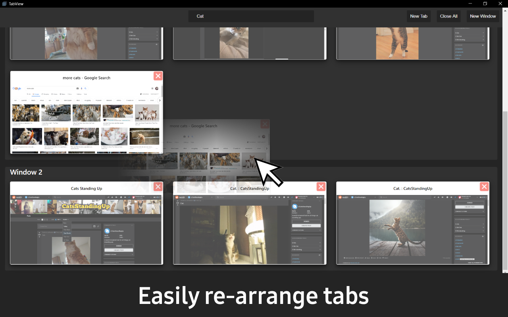

# TabView

A chrome extension for quickly switching between open browser tabs visually. Search, open, close, re-arrange, create and preview browser tabs all in one location.  Hot key access (Shift+Ctrl+Space) for quick access to TabView. 

 

Chrome Web Store Link  
https://chrome.google.com/webstore/detail/tabview/bgcmjpjlnpbhjoehlpmadpljgaigilmj

 

# Screenshots

  
   
  
  

# Credits
<a href="https://github.com/SortableJS/Sortable">SortableJS</a>

 
Just if you want to, <a href="https://www.paypal.me/larrystaecey">paypal link</a>
